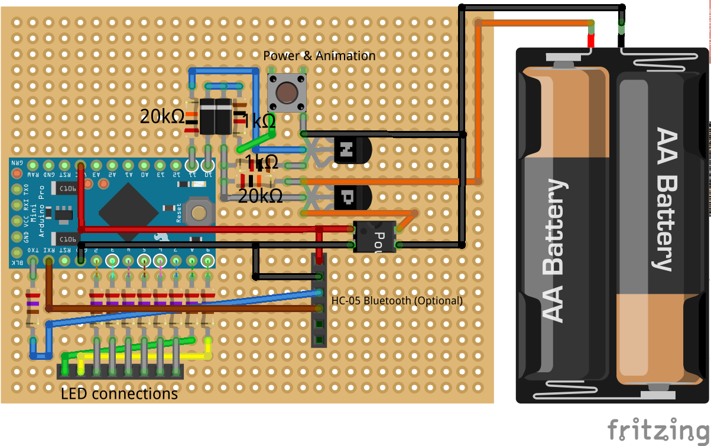
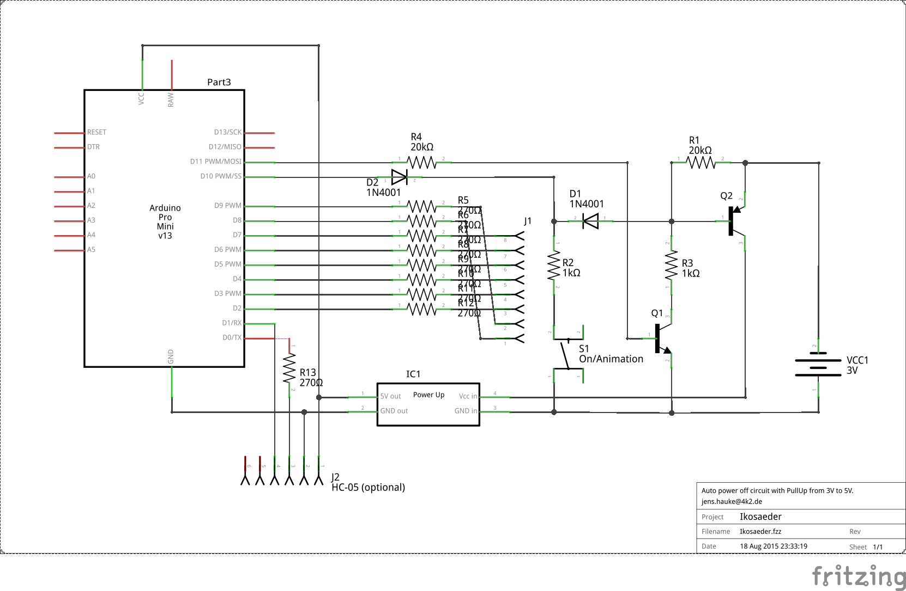

# LED Ikosaeder

This is the Arduino sketch for my first LED Ikosaeder.
The LED part is explained on my [homepage](http://www.4k2.de/ikosaeder).

# Schematic
Connect the 7 LED wires (via 220Ω) with the output pins D8, D9, D2, D3, D4 and D5.
Pin D7 is unused in this sketch.

